# Finding Lane Lines on the Road

*The processed images are in the `test_images_output` directory, while the `Writeup_images` contains the images used for this writeup.*

## Overview 

Lane identification is a preliminary requirement for development of autonomous driving systems. It is a task that is done by human drivers easily, based on lane markers or road end-points. It helps in maintaining lanes on the road, and thereby, facilitates smooth driving and minimizes collisions.

However, what seems like a trivial task to us is quite the challenge for the computer to perform. To solve this, several computer vision techniques have been developed over the years. We shall describe one such technique here as a part of the 1st project in the [Self Driving Car nanodegree from Udacity](https://www.udacity.com/course/self-driving-car-engineer-nanodegree--nd013).

---
**Goals of the project**

The main goals of the project are:

- Developing a processing pipeline for performing lane identification in images and videos.
- Describe the steps of the pipeline in this writeup
---

## Project Setup

---
**Test Dataset**

The developed pipeline is to be tested on: 
1. Six images (960 x 540 pixels) present in the `test_images` directory.
2. Three video files present in the `test_videos` directory.

**Code**

The code is present as a notebook file **P1.ipynb** which provides detailed functions, as well as the code execution steps. 

The Code has been develoed in python, and uses the following libraries:

- [**Numpy:**](https://numpy.org/) For the fast array processing routines.  
- [**OpenCV:**](https://opencv.org/) For the image processing routines.
- [**Matplotlib:**](https://matplotlib.org/) For the image Read/Write and plotting functions.
- [**MoviePy:**](https://pypi.org/project/moviepy/) For reading and editing the video files.

**Output**

The outputs are present in the `test_images_output` and the `test_videos_output` directories respectively.

---

## The Pipeline

---
The pipeline for processing the image is given below:

1. Isolate yellow and white markings from the image

    - Convert the image to HSL imagespace
    - Isolate the white and yellow from HSL parameters supplied.
    - Form an image mask for the next steps, which shall isolate the yellow and white markings.


2. Convert image to grayscale and apply the mask.
3. Apply Gaussian Blurring on the above image.
4. Perform Canny Edge Detection.
5. Isolate the region of interest from the Edge Detection result.
6. Perform Hough Transform, and get the Hough Lines Segments from there.
7. Separate the left and right lanes.
8. Aggregate the line segments, and Average/Extrapolate them.
9. Add Polynomial fitting support for curved lines
9. Apply the pipeline on images and video frames
---

### 1) Color Spaces

---

During implementation of the project, it was observed that it will be better to incorporate alternate color spaces like HSL and HSV in the project.

As an example, the sample image as visualized in the different color spaces are shown here:

RGB Space | HSV Space | HSL Space
:---: | :---: | :---:
 | 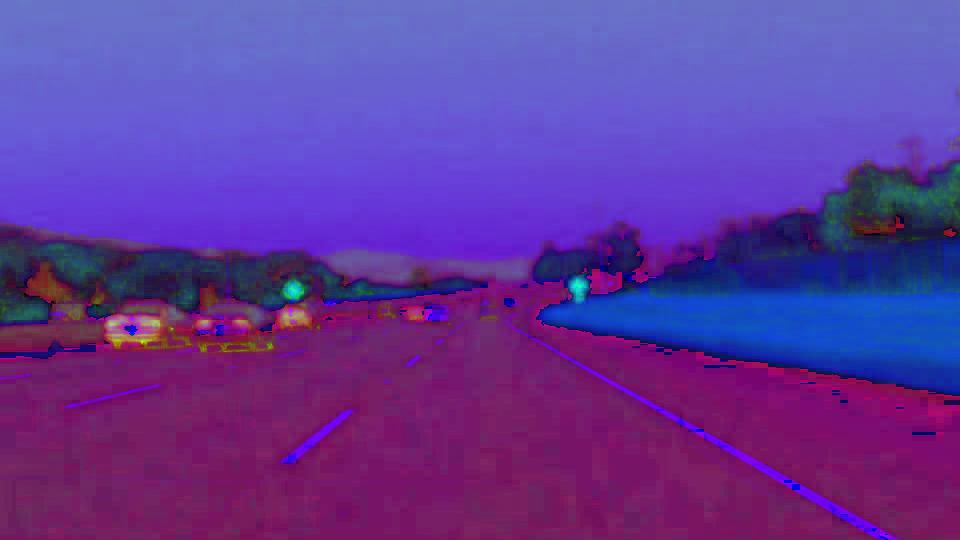 | 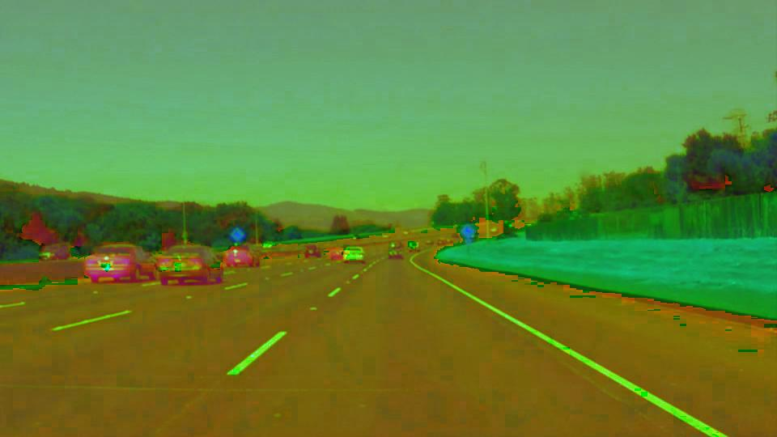
 | 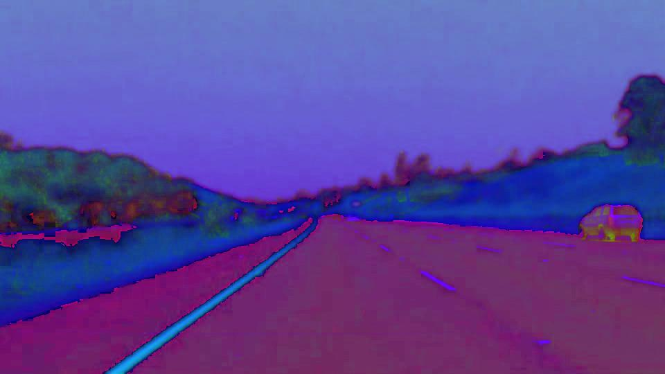 | 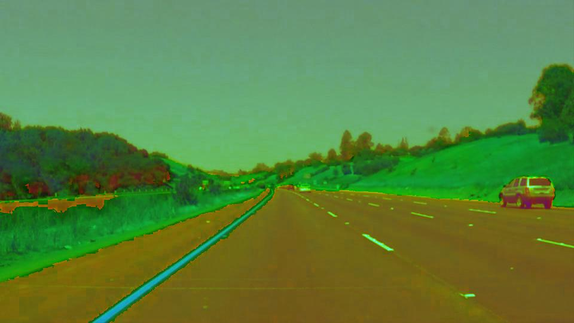

As can be seen while comparing images, HSL is better at contrasting lane lines than HSV. So, we shall use it for the project.
---

### 2) Determination of Yellow and White Markings from the Image

---

The next step is to isolate the yellow and white colored markings from the image. For that purpose, we shall use the `inRange()` function of OpenCV. This will generate a mask for us, which can be used for isolation of yellow (or white) from the image supplied.

**Yellow Mask**

The yellow mask is isolated using the following function: 
```python
def yellow_mask(img, lower_yellow_threshold=np.array([20,100,100]), higher_yellow_threshold=np.array([40, 255, 255])):
    return cv2.inRange(img, lower_yellow_threshold, higher_yellow_threshold)
```

Here, we define the two threshold values: 

- The lower threshold for yellow: `lower_yellow_threshold` with the HSL parameters of `[20, 100, 100]`.
- The upper threshold for yellow: `higher_yellow_threshold` with the HSL parameters `[40, 255, 255]`.

The parameters have been determined based on Hue value of 30 +/- 10, and Saturalion and lightness of 100-255 each.


**White Mask**

The yellow mask is isolated using the following function: 

```python
def white_mask(img, lower_threshold = np.array([0, 200, 0]), upper_threshold = np.array([255, 255, 255])):
    return cv2.inRange(img, lower_threshold, upper_threshold)
```

Here, we define the two threshold values: 

- The lower threshold for yellow: `lower_yellow_threshold` with the HSL parameters of `[0, 200, 0]`.
- The upper threshold for yellow: `higher_yellow_threshold` with the HSL parameters `[255, 255, 255]`.

**Combined Mask**

The yellow and white masks are finally combined via bitwise OR operation to generate a combined mask, which will be able to isolate the yellow or white markings easily.

```python
def combined_color_mask(img):
    hls_img = hls(img)
    mask_yellow = yellow_mask(hls_img)
    mask_white = white_mask(hls_img)
    return cv2.bitwise_or(mask_yellow, mask_white)
```

**Visulization**

The combined mask as described above can be visualized for two test images:

Original Image | Combined Mask 
:---: | :---: 
 | 
 | 

---


### 3. Conversion of the original Image to Gray Scale

---

We are interested in detecting white or yellow lines on images, which show a particularly high contrast when the image is in grayscale. 

This is why, conversion from RGB space to grayscale is carried out, which also helps to reduce the noise from the other channels of the image.

```python
def grayscale(img):
    return cv2.cvtColor(img, cv2.COLOR_RGB2GRAY)
```

The grayscale image is combined with the yellow and white masks, to isolate only the yellow and white markings from the image.

```python
gray = grayscale(image)
grayed_masked = cv2.bitwise_and(gray, gray, mask = color_mask)
```

**Visualization**

Original Image | Grayscale Image | GrayScale Image combined with Color Mask
:---: | :---: | :---:
 | 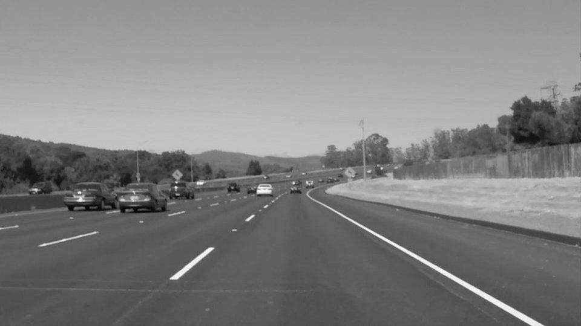 | 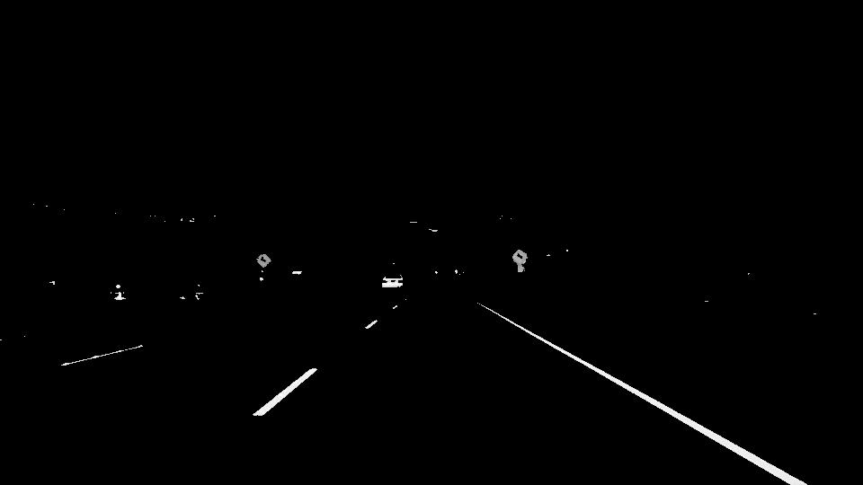
 |  | 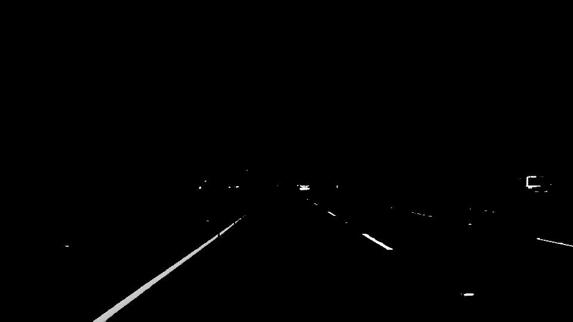


---

### 4. Gaussian Blur

---

[Gaussian blur](https://en.wikipedia.org/wiki/Gaussian_blur) (also referred to as Gaussian smoothing) is a pre-processing technique used to smoothen the edges of an image to reduce noise.

The OpenCV implementation of Gaussian Blur takes a integer kernel parameter which indicates the intensity of the smoothing. For our task we choose a value of _3_.

```python
def gaussian_blur(img, kernel_size=3):
    return cv2.GaussianBlur(img, (kernel_size, kernel_size), 0)

blur = gaussian_blur(grayed_masked, 3)
```

**Visualization**

Original Image | GrayScale Image | Blurred GrayScale Image
:---: | :---: | :---:
 |  | 
 |  | 

---

### 5. Canny Edge Detection

---

To identify the edges, we shall apply a [Canny Edge Detector](https://en.wikipedia.org/wiki/Canny_edge_detector). 

The OpenCV implementation requires passing in two parameters in addition to our blurred image, a low and high threshold which determine whether to include a given edge or not. A threshold captures the intensity of change of a given point. Any point beyond the high threshold will be included in our resulting image, while points between the threshold values will only be included if they are next to edges beyond our high threshold. Edges that are below our low threshold are discarded. We use values _70_ and _140_ respectively for low and high thresholds.

```python
def canny(img, low_threshold=70, high_threshold=140):
    return cv2.Canny(img, low_threshold, high_threshold)

canny_edges = canny(blur, 70, 140)
```

**Visualization**

Original Image | Canny Edge Detection Result
:---: | :---:
 | 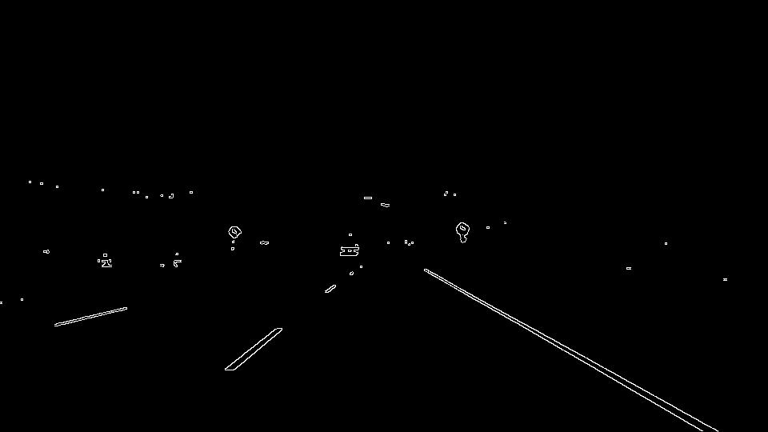 
 | 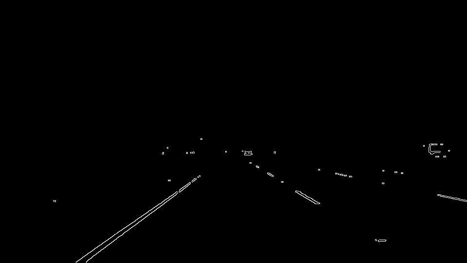

---

### 6. Isolating Region of Interest

---

The Canny Edge Detector detects all edges which are part of the image. This includes lines not part of our lane (the lane the car is driving) as well.

To isolate the lane, we define a polygonal region of interest, by defining the four vertices of a quadrilateral which aligns with our camer scope of view. For this project, the vertices were chosen to be:

```python
vertices = np.array([[100, canny_edges.shape[0]], 
                         [430, 320], 
                         [530, 320], 
                         [canny_edges.shape[1], canny_edges.shape[0]]], np.int32)

```

Please note that canny-Edges images were of 960 x 540 pixels shape.

The Region of Interest is calculated by the function:

```python
def region_of_interest(masked_image, vertices):
    mask = np.zeros_like(masked_image)
    if len(masked_image.shape) > 2:
        channel_count = masked_image.shape[2]  
        ignore_mask_color = (255,) * channel_count
    else:
        ignore_mask_color = 255
          
    cv2.fillPoly(mask, vertices, ignore_mask_color)
    return cv2.bitwise_and(masked_image, masked_image, mask = mask)

roi = region_of_interest(canny_edges, [vertices])
```

**Visualization**

Original Images | Canny Edges | Region of Interest
:---: | :---: | :---:
 |  | 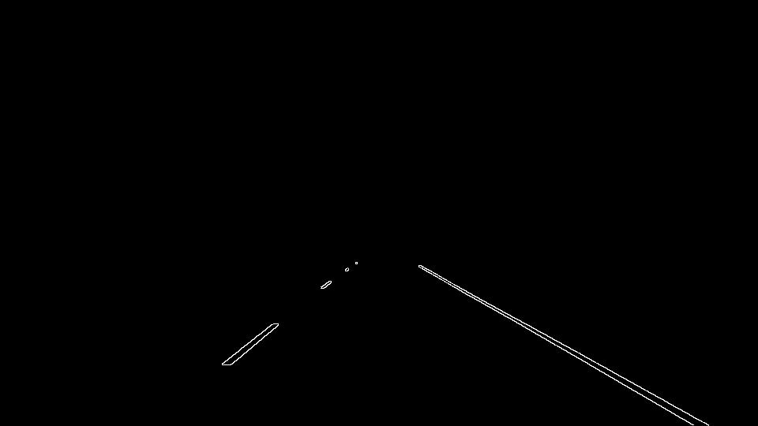
 |  | 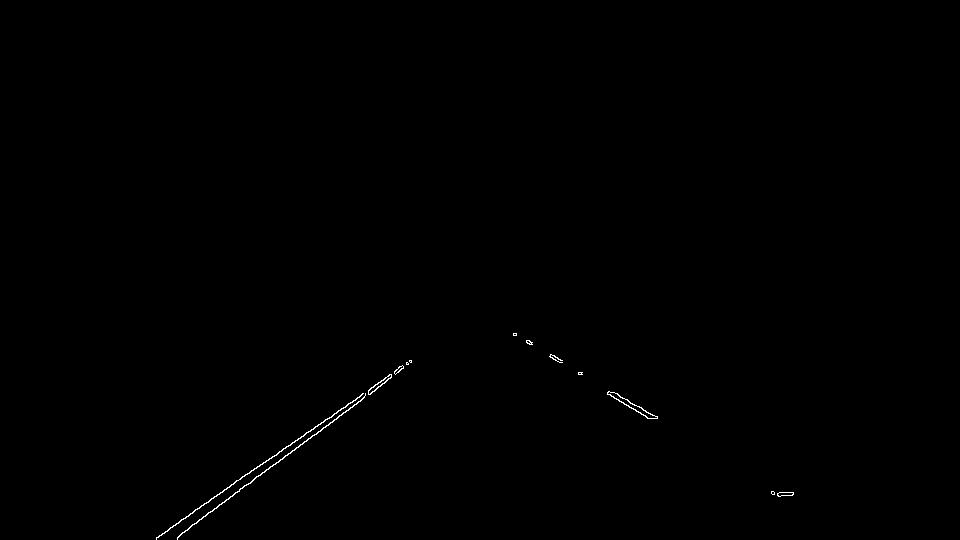

---

### 7. Extracting the Line Segments: Hough Transform

---

The next step is to extract the line segments from the image. For that, we shall make use of the Hough Transform.

**Hough Transform**

*Wikipedia: [Hough Transform](https://en.wikipedia.org/wiki/Hough_transform#:~:text=The%20Hough%20transform%20is%20a,shapes%20by%20a%20voting%20procedure.)*

> The Hough transform is a feature extraction technique used in image analysis, computer vision, and digital image processing. The purpose of the technique is to find imperfect instances of objects within a certain class of shapes by a voting procedure. This voting procedure is carried out in a parameter space, from which object candidates are obtained as local maxima in a so-called accumulator space that is explicitly constructed by the algorithm for computing the Hough transform.

The Hough transform converts the cartesian representation `(x,y)` of a line `y = mx + b` to the parametric space `(b, m)`. However, for perpendicular lines, the slope is undefined. Hence, for computational purpose, the parametric space chosen is the polar form of a line (ρ, θ).

In this plane:

- Lines are represented as points.
- Points are presented as lines.
- Intersecting lines means the same point is on multiple lines.
- Straight lines going through a point correspond to a sinusoidal curve in the (ρ, θ) plane.
- A set of points on the same line will lead to intersecting sinusoids, so our goal is to find such intersecting sinusoids in the Hough Space.


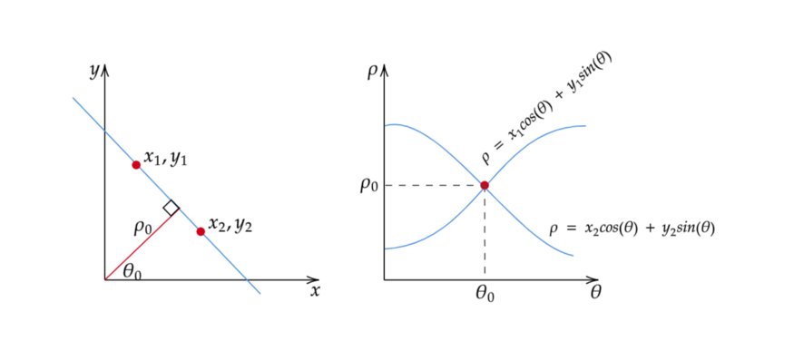

**OpenCV Implementation**

OpenCV includes two implementations of the Hough Transform. For more information, please have a look at the documentation [here](https://docs.opencv.org/3.4/d9/db0/tutorial_hough_lines.html).

We shall us use the probabilistic approach here (`cv2.HoughLinesP()`). The parameters used are:

- ρ: 1
- θ: pi/180
- Tolerance (number of votes): 30
- Minimum Line Length: 1
- Maximum Line Length for a particular line: 50

*Python Function*

```python
def hough_lines(img, rho, theta, threshold, min_line_len, max_line_gap):
    lines = cv2.HoughLinesP(img, rho, theta, threshold, np.array([]), minLineLength=min_line_len, maxLineGap=max_line_gap)
    line_img = np.zeros((img.shape[0], img.shape[1], 3), dtype=np.uint8)
    draw_lines(line_img, lines)
    return line_img

h_lines = hough_lines(roi, 1, np.pi/180, 30, 1, 10)
```

An example image with the houghLines on it are shown below:

Original Image | Hough Line Segments
:---: | :---:
 | 

---

### 8. Separating Left and Right Lanes

---

Separation of left and Right Lanes can be done easily, if we notice that:

- For the Left Lanes, as the x increases, y decreases, so the slope is **negative**.
- For the right lanes, as x increases, y increases, so the slope is **positive**.

Hence, the lanes can be identified by calculating the slopes of the hough line segments, and then classifying them to left or right lanes.

In order to avoid parallel lines for this project, we consider a threshold value for the slope (default=0.3), so that it is:

* A Left lane is `slope < -threshold`.
* A Right Lane if `slope > threshold`.

For implementation, please have a look at the `draw_lines()` function in the notebook. It has been annotated with comments for the important parts

**Visualization**

Original Images| Left and Right Lanes Segmented
:---: | :---:
 | 

---

### 9. Averaging and Interpolation

---

**Requirement**

The line segments generated by the hough transform are usually isolated and spaced away from each other. For a smooth and safe driving experience, we need to have continous lane segments to work with. 

For that, we shall interpolate to line segments. Two methods have been experimented with for this purpose, and are described below:

---

#### 9.1 Linear Interpolation

For Linear Interpolation, we shall fit a single line for the left and right lanes from the lane segments. The process undertaken is:

1. Determine the slope and intercept from the lane segments.
2. Find out the mean slope and the mean intercept from them for both the left and right lane segments individually.
3. The `y` coordinate for the two end points have been pre-fixed to `img.shape[0]` and `img.shape[0] * 0.7`. 
4. The `x` coordinate for the cooresponding points can be determined from `x = (y - mean_intercept)/mean_slope` for both the left and right lanes.
5. Draw the lines.


**Visualization**

Original Images| Interpolation result
:---: | :---:
 | 

---

#### 9.2 Polynomial Interpolation

The polynomial interpolation was developed for the purpose of smoothing the lane lines in the case of curved lanes. We shall consider a 2nd degree polynomial for the purpose, although a higher degree may also be specified.

The pipeline goes as follows:

1. Fit the polynomial function x = z(y) to the line segment points for the left and right lanes.
2. Find the maximum `ymax = max(y)` in the line segment points.
3. Generate a set of `y` points from `ymax` to `img.shape[0]*0.7`. Find out the correspoinding `x` from the polynomial function, and draw it.
4. If `ymax` is less than `img.shape[0]`, then draw a line from `(180, img.shape[0])` and `(870, img.shape[0])`.

**Visualization**

Original Images| Interpolation result
:---: | :---:
 | 

---

## Videos

---

### Setup

Three videos were also provided to run our pipeline against them:

* a 10 seconds video with only white lane lines.
* a 27 seconds video with a continuous yellow lane line on the left and dotted white lane line on right.
* a _challenge_ video where the road is slightly curve and the resolution frames is higher. It also has shadows in it.

### Running the pipeline

The pipeline was wrapped as a python function `process_image(image)`, which shall operate on the video frames. Both the Linera interpolation and the polynomial interpolation was executed on the videos.

### Result

**Linear Interpolation**

Linear Interpolation gives good results on the two example videos. It also gives a good result for the challenge video, but it flickers a little in the way. It needs more smoothing.

Check out the results of the pipeline: 
- [SolidWhiteRight](https://www.youtube.com/embed/7cdvC9K0i-4)
- [SolidYellowLeft](https://www.youtube.com/embed/nKsD9EzlFHY)
- [Challenge Video](https://www.youtube.com/embed/cUPvtBvio78)

**Polynomial Interpolation**

The polynomial interpolation didn't work so well across frames, as is evident here: 
- [SolidWhiteRight](https://www.youtube.com/embed/GnjOC9s3oWw)

---

## Shortcomings

The following shortcomings were observed with the current version of the pipeline:

- The polynomial interpolation doesn't work too well on videos, if there are a less number of line segments detected. It is better to use linear interpolations in that case.
- The interpolation results were not very smooth in case of the challenge video.
- The Parameters were tricky to identify. Possibly better parameters exist.
- The camera needs to be fixed at the current spot in all cases. This is required, as the vertices are hard coded in Region of Interest Detection.

## Future Improvements

The following improvements are planned for future:

- Use a memory based approach for smoothing of the lines in the videos, which shall use the data from past frames as well.
- Develop an algorithm to identify the Region of Interest dynamically.
- Use a different method to determine a larger number of points from the lane lines, so that a smooth curve can be fitted there.
- Use deep learning for the process.


*Disclaimer:* During the project implementation, I was inspired from the writeups by previous Nanodegree students [Nachiket Tanksale](https://towardsdatascience.com/finding-lane-lines-simple-pipeline-for-lane-detection-d02b62e7572b) (on the topics of HSL color space and video processing ideas) and [Mark Misener](https://github.com/markmisener/udacity-self-driving-car-engineer) (on I/O requirements and general arrangement of functions, in particular the `process_image()` in the project).   